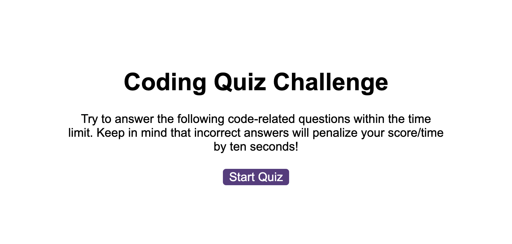

# Quiz

## Description 
> In challenge 6 I created a timed, multiple-choice quiz that can keep track of high scores and quiz-takers' initials. 

## Usage 
To access the solution open the below link to deployed application.
* Deployed application - [https://marzena-w.github.io/quiz/]
* Click button "Start Quiz"
* Answer all questions
* Add initials
* Screenshot:

## Credits

* How to remove class - [https://www.w3schools.com/howto/howto_js_remove_class.asp]
* To delay the execution of the next step - [https://www.w3schools.com/jsref/met_win_settimeout.asp]
* How to connect a local file - [https://stackoverflow.com/questions/442384/jumping-to-a-new-html-page-with-javascript]
* To see website updates - Live Server - [https://marketplace.visualstudio.com/items?itemName=ritwickdey.LiveServer]

## License
MIT
